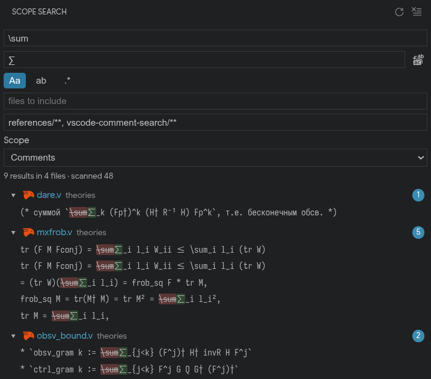

# Scope Search

VS Code extension for searching and replacing within semantic scopes (comments by default), using TextMate grammars and Tree-sitter from installed language extensions.

<p align="center">
  
</p>

## Install

Download the latest `.vsix` from [GitHub Releases](https://github.com/F1uctus/vscode-scope-search/releases) and install it:

```bash
code --install-extension scope-search-0.1.0.vsix
```

Or build locally:

```bash
npm ci
npm run package
code --install-extension packages/extension/scope-search-*.vsix
```

## Usage

Open the **Scope Search** view in the activity bar. Search respects scope (Comments, Strings, etc.), include/exclude globs, and regex/case/word options. Replace supports per-match, per-file, and global replace with undo.

Default keybinding: `Ctrl+Shift+Alt+F` (`Cmd+Shift+Alt+F` on macOS).

## CLI

The monorepo also ships a minimal CLI:

```bash
npm run build -w @scope-search/cli
node packages/cli/dist/main.js --query TEXT --scope comment [PATH...]
```

## Development

```bash
npm ci
npm run build
npm test
```

Open this folder in VS Code and launch the **Extension** target from `packages/extension`.

## License

MIT
